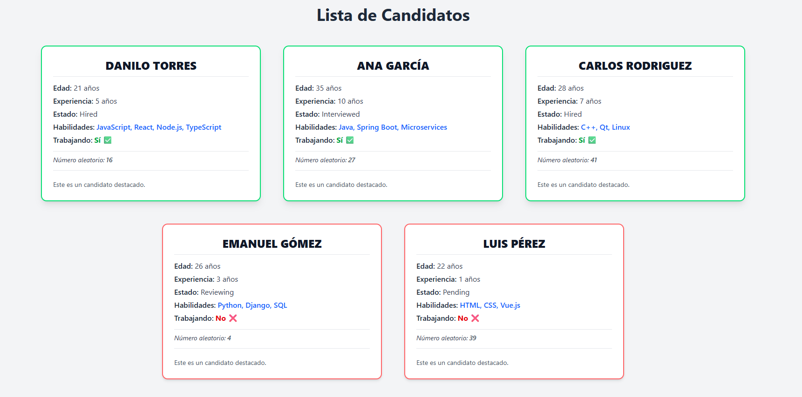

# 📘 Candidate Board - Unidad 1

Aplicación construida con **React + TypeScript**, que muestra un listado de candidatos con datos interactivos como experiencia, habilidades, estado y disponibilidad laboral. Esta unidad introduce componentes reutilizables, rutas dinámicas y estilos con TailwindCSS.

## 📂 Estructura del Proyecto

```
└── my-app/
├── public/
├── src/
│ ├── components/ # Componente principal: Candidate
│ ├── routes/ # Rutas gestionadas con TanStack Router
│ ├── types/ # Tipos TypeScript personalizados
│ ├── App.css # Estilos globales
│ ├── main.tsx # Punto de entrada React
│ ├── reportWebVitals.ts
│ ├── routeTree.gen.ts # Árbol de rutas generado
│ └── styles.css # Estilos adicionales
├── index.html
├── package.json
├── tsconfig.json
├── vite.config.ts
└── README.md

```

## 🚀 Tecnologías Usadas

- ⚛️ **React 18**
- 🧑‍💻 **TypeScript**
- 🧭 **TanStack Router**
- 🎨 **TailwindCSS**
- ⚡ **Vite**


## 📸 Vista Previa



---

## 📦 Instalación

```bash
git clone --filter=blob:none --sparse https://github.com/DaniloTorres2001/React_Module.git
cd React_Module
git sparse-checkout set "Unidad 1/my-app"
cd "Unidad 1/my-app"
npm install
npm run dev
```
💡 Este método solo clona la carpeta Unidad 1/my-app sin descargar todo el repositorio.

## 🧩 Funcionalidades

Representación visual de candidatos con diseño responsivo.

Uso de componentes reutilizables con props y children.

Generación de número aleatorio como dato decorativo.

Uso de TailwindCSS para estilización rápida y eficaz.

Tipado estático para mantener consistencia con TypeScript.

## 🧪 Ejemplo de Candidato

``` bash
{
  name: 'Ana García',
  age: 35,
  experience: 10,
  skills: ['Java', 'Spring Boot', 'Microservices'],
  status: 'Interviewed',
  working: true,
}
```

## 📜 Scripts Disponibles
``` bash
npm run dev: Inicia el servidor de desarrollo.

npm run build: Compila la app para producción.

npm run preview: Vista previa del build.
```
## ✅ Pendientes / TODO
 Funcionalidad de copiar texto en portapapeles.

 Mejoras visuales y animaciones de entrada.

## 📄 Licencia
MIT © Danilo Torres

Files prefixed with `demo` can be safely deleted. They are there to provide a starting point for you to play around with the features you've installed.

# Learn More

You can learn more about all of the offerings from TanStack in the [TanStack documentation](https://tanstack.com).