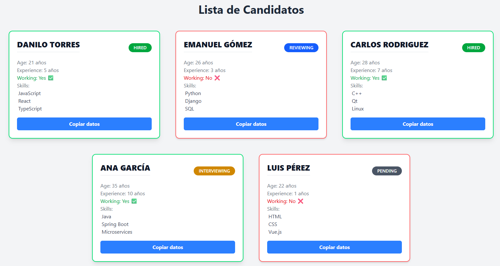

# 📘 Candidate Board App Unidad 2

Aplicación desarrollada en **React + TypeScript** que muestra una lista interactiva de candidatos con información detallada, estados laborales y habilidades técnicas. Permite copiar los datos al portapapeles con un solo clic.

## 📂 Estructura del Proyecto

```Estructura del proyecto
my-app/
├── public/ # Archivos estáticos
├── src/
│ ├── components/ # Componentes reutilizables (Candidate)
│ ├── routes/ # Rutas definidas con TanStack Router
│ ├── types/ # Tipado TypeScript (CandidateType)
│ ├── utils/ # Funciones auxiliares (estilos, helpers)
│ ├── App.css # Estilos globales
│ ├── main.tsx # Punto de entrada principal
│ ├── routeTree.gen.ts # Generado por TanStack Router
│ └── styles.css # Estilos personalizados
├── index.html # HTML base
├── package.json # Dependencias y scripts
├── vite.config.ts # Configuración de Vite
└── tsconfig.json # Configuración de TypeScript

```

## 🚀 Tecnologías Usadas

- ⚛️ **React 18**
- 🧑‍💻 **TypeScript**
- 🎨 **TailwindCSS**
- 🧭 **TanStack Router**
- ⚡ **Vite**

## 📥 Clonar solo esta carpeta (`Unidad 2/my-app`) desde el repositorio completo

Si deseas clonar únicamente esta carpeta sin descargar todo el repositorio, puedes hacerlo usando **sparse checkout**:

```bash
git clone --filter=blob:none --sparse https://github.com/DaniloTorres2001/React_Module.git
cd React_Module
git sparse-checkout set "Unidad 2/my-app"
cd "Unidad 2/my-app"
npm install
npm run dev
```

## 📸 Vista Previa




## 🧩 Funcionalidades

Renderizado dinámico de una lista de candidatos.

Estados laborales visuales: Hired, Reviewing, Interviewing, Pending.

Copia de datos del candidato al portapapeles.

Responsive con diseño moderno y sombreado condicional.

## 📁 Ejemplo de Candidato
```bash
{
  name: 'Ana García',
  age: 35,
  experience: 10,
  skills: ['Java', 'Spring Boot', 'Microservices'],
  status: 'Interviewing',
  working: true,
}
```

## 📜 Scripts Disponibles
```
npm run dev: Inicia el servidor de desarrollo.

npm run build: Compila para producción.

npm run preview: Vista previa del build.
```
## 📜✅ TODO
 Conectar con API externa para candidatos.

 Agregar autenticación de usuarios.

 Añadir filtros por estado o skills.

## 📜📄 Licencia
MIT © DaniloTorres

Files prefixed with `demo` can be safely deleted. They are there to provide a starting point for you to play around with the features you've installed.

# Learn More

You can learn more about all of the offerings from TanStack in the [TanStack documentation](https://tanstack.com).
